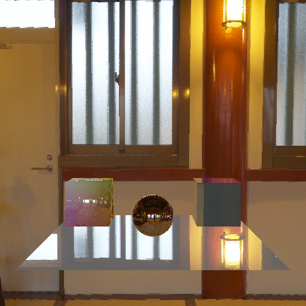

# HDR
高輝度テクスチャを使った画面を作ります。

https://webglstudy.github.io/12_HDR/

# 課題
次の問題に挑戦してみてください。

- 別のHDRIキューブマップを使ってみよう

# 課題の進め方
次のように課題を解いてみてください。

- プロジェクトをforkします
- GitHub Pages の機能を使って、ホームページを立ち上げます
- 問題を解きます
- GitHub Pages で正答したか確認しましょう

# 謝辞
今回のリポジトリでは次のアセットを使わせていただいています。

- Christian Bloch 氏の Ueno Shrineの画像
  - http://www.hdrlabs.com/sibl/archive.html
- Enki Mute 氏の hdrpng.js
  - https://enkimute.github.io/hdrpng.js/
- wgld.org の minMatrix.js
  - https://wgld.org/d/library/l001.html
